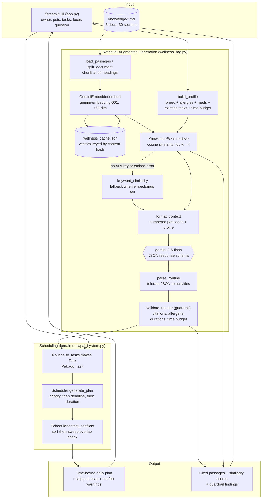

# PawPal+ — Applied AI System (Project 4)

PawPal+ is a pet-care planning assistant. It started as a rule-based scheduler
that time-boxed a pet owner's day. This project extends it with a
**retrieval-augmented wellness advisor**: the system now decides *what* care a
particular pet needs by retrieving from a local pet-care knowledge base and
grounding a Gemini model in what it found — then feeds those suggestions back
into the original scheduler as real tasks.

| Rubric requirement | Where it lives |
|---|---|
| Base project & original scope | [The base project](#the-base-project-module-2) |
| New AI feature (RAG) | [What's new](#whats-new-a-retrieval-augmented-wellness-advisor) · `wellness_rag.py` |
| Architecture diagram | [Architecture](#system-architecture) · `diagrams/architecture.mmd` |
| End-to-end demonstration | [Running it end to end](#running-it-end-to-end) |
| Reliability / guardrail | [Guardrails and evaluation](#guardrails-and-evaluation) · `evaluate.py` |
| Setup & test instructions | [Setup](#setup) · [Testing](#testing) |
| Reflection | [Reflection](#reflection-on-ai-collaboration-and-design) · `reflection.md` |

---

## The base project (Module 2)

**Original system:** PawPal+, a pet-care scheduler built from a UML design
(`diagrams/uml_final.mmd`) and implemented in `pawpal_system.py`.

**Original goal:** let an owner register pets and their care tasks, then have a
scheduler build a realistic daily plan under a fixed time budget.

**Original capabilities, all still present:**

- **Domain model** — `Task` (duration, priority, deadline, recurrence),
  `Pet` (breed, medications, allergies, food preference, its own task list),
  `Owner` (available minutes, preferences, pets), `Scheduler` (the planner).
- **Sorting** — `Scheduler.sort_by_time()` orders tasks chronologically by
  deadline; `generate_plan()` sorts by **priority → deadline → duration**.
- **Filtering** — `generate_plan()` drops tasks once the time budget runs out
  (marking them `skipped`); `Owner.filter_pets()` filters pets by name and/or
  completion state.
- **Conflict detection** — `detect_conflicts()` sweeps scheduled tasks in
  O(n log n) and warns about overlapping start times instead of crashing.
- **Recurring tasks** — completing a daily/weekly task auto-spawns its next
  occurrence.

**The limitation this project addresses:** the original system could only
schedule tasks the owner had already thought of. It had no idea that a
4-month-old puppy shouldn't jog on pavement, or that a senior cat needs a warm-up
before play. All domain knowledge lived in the owner's head.

---

## What's new: a retrieval-augmented wellness advisor

`wellness_rag.py` adds a full RAG pipeline that suggests care activities for a
specific pet, grounded in a curated knowledge base rather than model memory.

**Why RAG and not just a prompt?** Pet-care advice is exactly the domain where a
plausible-sounding hallucination is harmful. Retrieval means every suggestion
points at a passage you can read, and the guardrail below drops anything that
cites a passage that was never retrieved.

### The pipeline

| Step | Implementation | Detail |
|---|---|---|
| **Load** | `load_passages`, `split_document` | Reads `knowledge/*.md`, splits each file at its `##` headings so one chunk is one self-contained topic. 6 documents → 30 passages. |
| **Embed** | `GeminiEmbedder`, `KnowledgeBase.ensure_embeddings` | `gemini-embedding-001` at 768 dimensions. Vectors cached in `.wellness_cache.json`, keyed by a hash of the passage — editing one section re-embeds only that section. |
| **Retrieve** | `build_profile`, `KnowledgeBase.retrieve` | The query is a profile of the pet: breed, allergies, medications, existing tasks, the owner's time budget, and an optional free-text question. Top-4 by cosine similarity. Documents embed as `RETRIEVAL_DOCUMENT`, the query as `RETRIEVAL_QUERY`. |
| **Generate** | `WellnessAdvisor.suggest` | Numbered passages + profile → `gemini-3.6-flash` with a JSON response schema, so activities come back as structured data, not prose. |
| **Validate** | `validate_routine` | Guardrail — see [below](#guardrails-and-evaluation). |
| **Integrate** | `Routine.to_tasks` | Each surviving activity becomes a real `Task`, which the **original** `Scheduler` then sorts, time-boxes, and conflict-checks like any other. |

### Integration, not a side demo

The feature is wired into the working system in both directions:

- It **reads** live domain state — the pet's allergies and medications, the
  tasks it already has, and the owner's remaining minutes all shape the query
  and the prompt.
- It **writes** back into the domain — accepted activities become `Task`
  objects on the `Pet`, and the existing scheduler plans them. A suggestion that
  doesn't fit the day gets `skipped` by the same budget logic as a hand-entered
  task.

### The knowledge base

`knowledge/` holds six documents, 30 retrievable sections:

| File | Covers |
|---|---|
| `dog-exercise.md` | Exercise by energy level, puppy growth plates, sniffing walks, heat/pavement safety, over-exercise signs |
| `cat-enrichment.md` | Hunting-cycle play, vertical space, food puzzles, scratching, boredom signs |
| `nutrition-and-allergies.md` | Meal timing, elimination diets, treat budgeting, hydration, toxic foods |
| `grooming-and-dental.md` | Brushing by coat type, bathing, nails/ears/paws, dental care, shedding season |
| `medication-and-vet-routines.md` | Dose timing, pilling technique, missed doses, preventatives, when to seek care |
| `senior-and-behavioural-wellness.md` | Senior adjustments, sleep, routine, training, separation, multi-pet homes |

To extend it, drop another `.md` file in with `#` for the title and `##` per
topic. Nothing else changes — new sections are picked up and embedded on the
next run.

---

## System architecture

Source: [`diagrams/architecture.mmd`](diagrams/architecture.mmd) (Mermaid).
The class diagram for the original domain model is
[`diagrams/uml_final.mmd`](diagrams/uml_final.mmd).



---

## Setup

```bash
# 1. Clone and enter the project
cd applied-ai-system-project

# 2. Create and activate a virtual environment
python -m venv .venv
source .venv/bin/activate          # Windows: .venv\Scripts\activate

# 3. Install dependencies (streamlit, pytest, google-genai)
pip install -r requirements.txt

# 4. Add a Gemini API key
cp .env.example .env               # Windows: copy .env.example .env
# then paste your key into .env — free key from https://aistudio.google.com/apikey
```

`.env` should end up looking like:

```
GEMINI_API_KEY=AIza...your-key...
```

`GEMINI_API_KEY` (or `GOOGLE_API_KEY`) can also be set as a normal environment
variable. `.env` is gitignored — never commit a real key.

**Without a key the system still runs.** Retrieval falls back to keyword
scoring and the UI shows the retrieved guidance; only the generated routine is
unavailable.

---

## Running it end to end

### 1. The Streamlit app (primary interface)

```bash
streamlit run app.py
# opens http://localhost:8501
```

The page follows the order the day is actually planned:

1. **Sidebar** — owner name, minutes available today, add pets, search pets,
   and the advisor's status (`✅ Gemini connected · 30 passages indexed`).
2. **Today's pet care** — metrics for pets, open tasks, care time needed vs
   available, and a budget bar.
3. **🧠 Wellness routine** — pick a pet, optionally type a focus question, and
   press *Suggest*. You get a summary, the activities with durations/priorities
   and a cited reason each, any cautions, the guardrail findings, and an
   expander showing every retrieved passage with its similarity score. One
   button adds the whole routine to the pet's tasks.
4. **✅ Tasks** — add/complete tasks, with recurrence spawning the next occurrence.
5. **📅 Today's schedule** — the original scheduler: time-boxed plan, tasks that
   didn't fit, and conflict warnings.

### 2. The scheduler CLI demo

```bash
python main.py
```

<details>
<summary>Sample output</summary>

```
Tasks as added (out of order):
----------------------------------------
  deadline --:--  Enrichment play (20 min) [priority: low] - Biscuit
  deadline 09:00  Morning walk (30 min) [priority: high] - Biscuit
  deadline --:--  Grooming (25 min) [priority: medium] - Biscuit
  deadline 08:30  Breakfast (10 min) [priority: high] - Biscuit
  deadline --:--  Short walk (20 min) [priority: medium] - Max
  deadline 09:00  Feeding (10 min) [priority: high] - Max
  deadline 08:15  Medication (5 min) [priority: high] - Max

Sorted by time (earliest deadline first):
----------------------------------------
  deadline 08:15  Medication (5 min) [priority: high] - Max
  deadline 08:30  Breakfast (10 min) [priority: high] - Biscuit
  deadline 09:00  Morning walk (30 min) [priority: high] - Biscuit
  deadline 09:00  Feeding (10 min) [priority: high] - Max
  deadline --:--  Enrichment play (20 min) [priority: low] - Biscuit
  deadline --:--  Grooming (25 min) [priority: medium] - Biscuit
  deadline --:--  Short walk (20 min) [priority: medium] - Max

Today's Schedule for Sam
(available time: 120 min)
----------------------------------------
  08:00 - Medication (5 min) [priority: high] - Max
  08:05 - Breakfast (10 min) [priority: high] - Biscuit
  08:15 - Feeding (10 min) [priority: high] - Max
  08:25 - Morning walk (30 min) [priority: high] - Biscuit
  08:55 - Short walk (20 min) [priority: medium] - Max
  09:15 - Grooming (25 min) [priority: medium] - Biscuit
  09:40 - Enrichment play (20 min) [priority: low] - Biscuit

Completing recurring tasks (today = 2026-07-15):
----------------------------------------
  Grooming (weekly) done -> next occurrence due 2026-07-22
  Medication (daily) done -> next occurrence due 2026-07-16

Checking for schedule conflicts:
----------------------------------------
WARNING: schedule conflict - 'Vet appointment' (Biscuit) and 'Bath' (Max) overlap at 09:30.
  Program still running - 1 conflict(s) reported, not crashed.
```

</details>

### 3. Three example inputs through the full RAG pipeline

```bash
python evaluate.py -v
```

This runs three deliberately different pet profiles end to end against Gemini
and asserts the output invariants. Real output:

```
Live end-to-end — 3 profiles against Gemini

  [PASS] Mochi (Border Collie) — 4 activities, 60/60 min, vector retrieval
         summary: Mochi is a high-energy Border Collie needing structured work and mental
         exercise to prevent boredom and destructive behaviors like chewing [1]. Since he
         already has a 30-minute morning walk, this 60-minute routine adds a decompression
         sniff walk [2] and indoor enrichment activities like training, scatter feeding,
         and structured play [3] to keep him mentally tired without exceeding your budget.
         · Decompression sniff walk (20 min, high) — A late-afternoon sniff-led walk lowers
           arousal and mentally tires dogs far more efficiently than standard walking [2].
         · Conduct indoor training session (15 min, high) — High-energy working breeds need
           structured work, and a 10-15 minute training session provides mental stimulation
           to combat boredom [1][3].
         · Set up scatter feeding (15 min, medium) — Scatter feeding is an effective indoor
           enrichment activity that engages the dog's brain and prevents boredom [3].
         · Play stair recalls or tug (10 min, medium) — Structured indoor physical play
           provides extra physical output for high-energy breeds [1][3].

  [PASS] Willow (senior indoor cat) — 4 activities, 30/30 min, vector retrieval
         summary: Willow's difficulty jumping onto the sofa is a typical indication of joint
         stiffness and arthritis in senior cats. This 30-minute routine incorporates gentle
         physical warm-ups, reward-based cooperative handling, scheduled quiet rest, and
         mental enrichment while respecting her physical limitations.
         · Gentle warm-up walk (5 min, high) — Five minutes of slow walking warms up muscles
           and helps manage joint stiffness before play or movement [1].
         · Practice cooperative handling (5 min, medium) — Short 5-minute sessions of
           reward-based cooperative handling build mental exercise and reduce stress [4].
         · Protect quiet rest block (15 min, high) — Cats require 12-16 hours of daily sleep,
           so protecting an uninterrupted rest block maintains mood and impulse control [2].
         · Prepare food puzzle (5 min, low) — A food puzzle provides positive mental
           stimulation and rewards quiet independent time [3].

  [PASS] Biscuit (4-month-old Golden Retriever puppy) — 4 activities, 65/90 min, vector retrieval
         summary: For a 4-month-old Golden Retriever puppy, safe formal exercise is about
         20 minutes twice daily (5 minutes per month of age). Because large breed growth
         plates remain open until 12-18 months, avoid high-impact activities like pavement
         jogging, stair sprints, or jumping.
         · Morning soft-ground walk (20 min, high) — At 4 months old, Biscuit should have
           20 minutes of formal exercise twice daily to protect growing joints [1].
         · Evening soft-ground walk (20 min, high) — Splitting daily activity into two
           shorter sessions provides bathroom breaks and avoids overexertion [1] [2].
         · Self-paced yard play (15 min, medium) — Free play on soft grass where the puppy
           sets its own pace is safer for open growth plates than distance walking [1].
         · Indoor training session (10 min, medium) — A 10-minute indoor training session
           offers mental enrichment without physical impact on growth plates [4].

All checks passed.
```

Note how the system behaves consistently across three very different inputs, and
how each claim traces back to a retrieved passage — the puppy's "5 minutes per
month of age" comes verbatim from `dog-exercise.md`, not from model memory.

---

## Guardrails and evaluation

The prompt *asks* the model to stay grounded, respect the time budget, and avoid
the pet's allergens. Asking is not enforcing. `validate_routine()` re-checks
every constraint in code after generation, repairs what it can, and records what
it did on `routine.issues` (shown in the UI under *🛡️ Guardrail*).

| Check | Severity | Action |
|---|---|---|
| `bad_citation` — cites a passage number that was never retrieved | error | **drop the activity** (a fabricated source means an unsupported claim) |
| `allergen_conflict` — activity names one of the pet's allergens | error | **drop the activity** |
| `budget_exceeded` — total exceeds the owner's available minutes | error | **drop lowest-priority activities** until it fits |
| `implausible_duration` — ≤ 0 or > 240 minutes | error | **clamp** into range |
| `missing_citation` — no `[n]` anywhere in the reason | warning | keep, but flag as untraceable |
| `duplicate_task` — repeats a task the pet already has | warning | keep, but flag |
| `no_activities` — nothing survived | error | report; the UI shows the retrieved passages instead |

Two further layers sit around it: a **JSON response schema** on the API call so
the model cannot return prose, and **tolerant parsing** that skips a single
malformed activity rather than losing the whole response.

### Demonstrating the guardrail

`evaluate.py --offline` replays hand-written model outputs — one clean, six
adversarial — through the guardrail. It is deterministic and needs no API key:

```bash
python evaluate.py --offline -v
```

```
Guardrail replay — 7 cases, 4 retrieved passages

  [PASS] clean routine passes untouched — 0 issue(s)
           kept: ['Sniff walk', 'Brush teeth']
  [PASS] over-budget routine is trimmed to fit — 1 issue(s)
           [error] budget_exceeded: 70 min suggested, 45 min available
           kept: ['Long hike']
  [PASS] allergen suggestion is dropped — 1 issue(s)
           [error] allergen_conflict: 'Chicken treat training' mentions allergen 'chicken'
           kept: ['Sniff walk']
  [PASS] fabricated citation is dropped — 1 issue(s)
           [error] bad_citation: 'Hydrotherapy' cites [9] but only 4 passages were retrieved
           kept: ['Sniff walk']
  [PASS] uncited activity is kept but flagged — 1 issue(s)
           [warning] missing_citation: 'Evening cuddle' cites no passage
           kept: ['Evening cuddle']
  [PASS] implausible duration is clamped — 1 issue(s)
           [error] implausible_duration: 'Marathon' had 0 min
           kept: ['Marathon']
  [PASS] duplicate of an existing task is flagged — 1 issue(s)
           [warning] duplicate_task: 'Morning walk' is already a task
           kept: ['Morning walk']
  [PASS] non-JSON response raises GenerationError

All checks passed.
```

#### Worked examples

**Example 1 — hallucinated source.** The pet is a Border Collie; four passages
were retrieved.

*Model output:*

```json
{"name": "Hydrotherapy", "duration_minutes": 20, "priority": "high",
 "why": "Recommended for joint support [9]."}
```

*Guardrail behaviour:* `[9]` is outside the four retrieved passages, so the
claim has no source in the knowledge base.

*Result:* activity dropped, `bad_citation` recorded, the rest of the routine
kept. The user never sees the ungrounded suggestion.

**Example 2 — allergen.** The pet's profile lists an allergy to chicken.

*Model output:*

```json
{"name": "Chicken treat training", "duration_minutes": 10, "priority": "medium",
 "why": "Short sessions build focus [1]."}
```

*Guardrail behaviour:* "chicken" matches a listed allergen in the activity text.

*Result:* activity dropped, `allergen_conflict` recorded. This is the check that
matters most — the citation was valid, so grounding alone would not have caught it.

**Example 3 — over budget.** The owner has 45 minutes; the model suggests 70.

*Model output:*

```json
[{"name": "Long hike", "duration_minutes": 40, "priority": "high", "why": "... [1]"},
 {"name": "Tug session", "duration_minutes": 30, "priority": "low",  "why": "... [1]"}]
```

*Guardrail behaviour:* 70 > 45, so activities are dropped lowest-priority-first
until the routine fits.

*Result:* `Long hike` (40 min, high) kept, `Tug session` (30 min, low) dropped,
`budget_exceeded` recorded. The routine now fits the day the scheduler has to plan.

### Graceful degradation

Nothing hard-fails when Gemini is unavailable:

| Failure | Behaviour |
|---|---|
| No API key / SDK not installed | `MissingAPIKey`; UI still shows retrieved guidance |
| Embedding call fails mid-session | Retrieval falls back to `keyword_similarity`; UI flags the degraded mode |
| Model returns non-JSON | `GenerationError` with the first 200 characters, surfaced in the UI |
| One malformed activity in valid JSON | Skipped; the rest of the routine survives |
| Corrupt embedding cache file | Re-embeds instead of crashing |
| Read-only checkout (cache can't be written) | Embeds each run instead of crashing |

---

## Testing

```bash
python -m pytest              # full suite
python -m pytest -v           # one line per test
python evaluate.py --offline  # guardrail evaluation (no API key needed)
```

```
============================= test session starts =============================
platform win32 -- Python 3.14.5, pytest-9.1.1, pluggy-1.6.0
collected 61 items

tests\test_pawpal.py ................                                    [ 26%]
tests\test_wellness_rag.py ............................................. [100%]

============================= 61 passed in 0.19s ==============================
```

**`tests/test_pawpal.py` (16 tests) — the original scheduler**

- Sorting and plan ordering, including the deliberate greedy tradeoff where
  `generate_plan` stops at the first task that doesn't fit.
- Recurring tasks: exactly one next occurrence, correct dates across month
  boundaries, no spawn for non-recurring tasks.
- Conflict detection: chained overlaps, back-to-back tasks not conflicting
  (half-open intervals), unscheduled tasks ignored.
- Boundary cases: zero budget, scheduler with no owner.

**`tests/test_wellness_rag.py` (45 tests) — the RAG layer.** No network: a fake
embedder stands in for Gemini, so the suite runs in a quarter of a second.

- **Chunking** — one passage per `##`, empty sections dropped, preamble excluded.
- **Retrieval** — cosine ranking picks the on-topic passage, `k` respected,
  zero-score passages dropped, correct asymmetric task types.
- **Caching** — a warm cache makes zero embed calls; an edited passage re-embeds
  only itself; a corrupt cache re-embeds rather than crashing.
- **Degradation** — missing key and raising embedder both fall back to keyword
  search instead of propagating.
- **Guardrail** — each check verified in isolation plus repair ordering, the
  `repair=False` reporting mode, and pets with no allergies being unaffected.
- **Parsing and handoff** — malformed activities skipped, non-JSON raises,
  unknown priorities default to medium, and the resulting tasks schedule
  through `generate_plan`.

---

## Project structure

```
applied-ai-system-project/
├── app.py                  # Streamlit UI (wellness → tasks → schedule)
├── pawpal_system.py        # original domain model + Scheduler
├── wellness_rag.py         # NEW: RAG pipeline + guardrail
├── evaluate.py             # NEW: evaluation harness (offline + live)
├── main.py                 # scheduler CLI demo
├── knowledge/              # NEW: 6 markdown docs → 30 retrievable passages
├── diagrams/
│   ├── architecture.mmd    # NEW: system data-flow diagram
│   ├── uml_final.mmd       # domain class diagram
│   └── uml_draft.mmd
├── tests/
│   ├── test_pawpal.py      # scheduler tests
│   └── test_wellness_rag.py# NEW: RAG + guardrail tests
├── reflection.md           # design reflection
├── .env.example            # copy to .env and add your key
└── requirements.txt
```

---

## Reflection on AI collaboration and design

The full design reflection is in [`reflection.md`](reflection.md). On the AI
collaboration specifically:

**How AI was used.** Claude Code was used as a pair programmer for the whole RAG
extension: drafting the pipeline structure, writing the knowledge-base
documents, generating the test suite, and reviewing the integration points
against the existing domain model. The workflow was iterative — describe the
constraint, get an implementation, run it, and correct from the actual output
rather than from the code as read.

**A helpful suggestion.** Returning the routine as **JSON against a response
schema** rather than as prose. The obvious first design was "ask for a routine
and print it", which would have made the feature a chat box bolted onto a
scheduler. Structured output is what let `Routine.to_tasks()` hand real `Task`
objects to the existing `Scheduler` — the difference between an isolated demo
and an integrated feature. The related suggestion to embed documents as
`RETRIEVAL_DOCUMENT` and the query as `RETRIEVAL_QUERY` measurably tightened
retrieval scores.

**A flawed suggestion.** The model confidently wrote `gemini-2.5-flash` as the
chat model — a plausible, widely-documented model ID that returned
`404 … no longer available to new users` on the first real call. The fix was to
query `client.models.list()` and pick a model the key can actually reach. The
lesson generalises: an LLM's knowledge of an API surface is a snapshot, and
anything version-dependent has to be verified against the live service, not
accepted because it looks right. A second, sharper example: during setup the API
key was written into `.env.example` — a **git-tracked** file — instead of `.env`.
It looked correct and would have leaked the key on the next commit. Both failures
share a shape: output that is syntactically perfect and contextually wrong, which
is exactly the failure mode the guardrail in this project exists to catch.

**Limitations.**

- The knowledge base is small (30 passages) and hand-written. Retrieval quality
  degrades on topics it does not cover; the model is instructed to say so, but
  a near-miss passage can still anchor an answer.
- Chunking is one passage per `##` heading. A long section is retrieved whole,
  which wastes context; a very short one may lack the terms to be found at all.
- The allergen check is substring matching. It catches "chicken treats" but not
  "poultry-based rewards" — a semantic check would be stronger.
- Retrieval is top-k with a fixed k=4 and no re-ranking, so a fifth genuinely
  relevant passage is silently lost.
- There is no memory across sessions: pets, tasks, and routines live in
  Streamlit's `session_state` and vanish on restart.
- Generation quality is not evaluated automatically — `evaluate.py` checks
  constraints (grounded, in budget, safe), not whether the advice is *good*.

**Future improvements.** Persist owners and pets to disk; add re-ranking and a
relevance threshold so weak matches are dropped rather than padded to k=4; run a
second model over each routine as an LLM-judge for a multi-model agreement
check; expand the allergen guardrail to embeddings so semantic near-misses are
caught; and let the scheduler feed completion history back into the profile so
routines adapt to what the owner actually finds time for.

---

*AI-generated wellness routines are grounded in the bundled knowledge base and
are not veterinary advice.*
